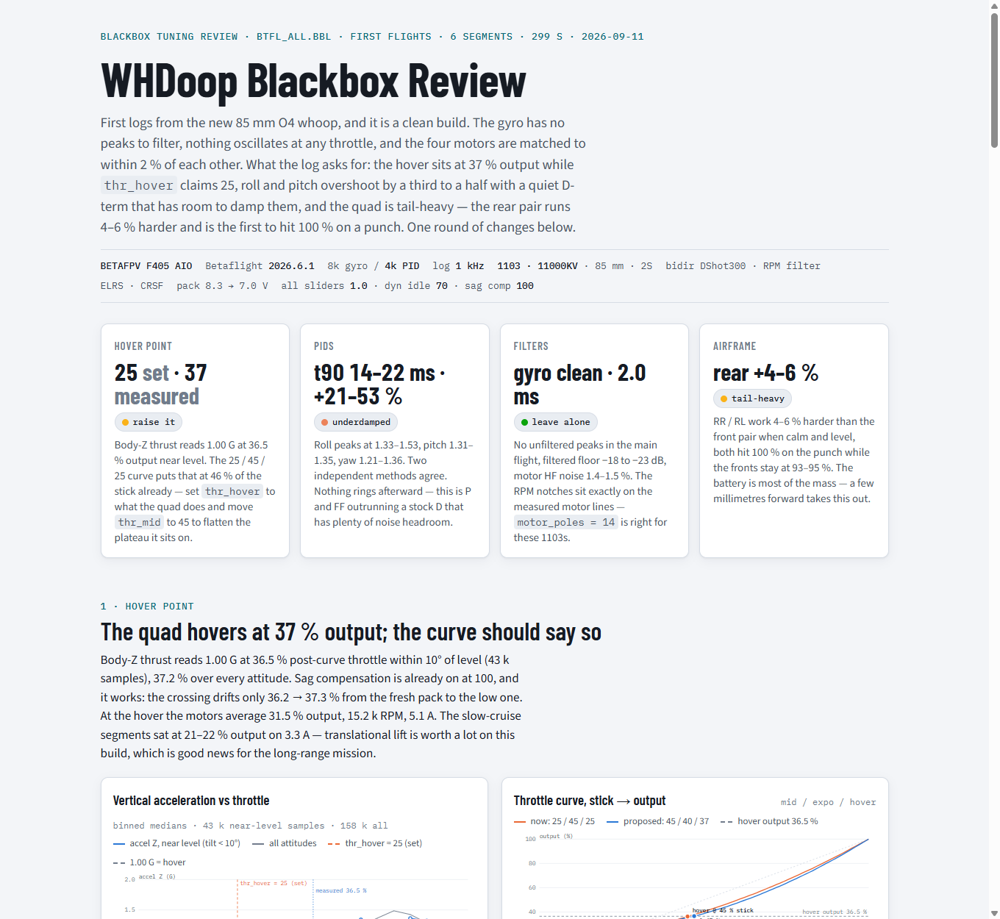

# postflight

Every flight session deserves a post-flight review.

**postflight** is a Betaflight blackbox tuning agent for [Claude Code](https://claude.com/claude-code):
hand it a `.bbl` log, and it decodes the flights, measures what the quad actually did —
hover point, step response, noise floors, motor balance, saturation, power — and publishes
a review page that reads like a newsletter: verdict first, every chart explained in plain
language, and one round of concrete `set` commands to fly before the next log.



## What it does

1. **Decodes** the log with [orangebox](https://github.com/coderus/orangebox) (pure Python —
   no Blackbox Explorer needed), splitting flash dumps into per-flight segments and
   surviving aborted arms and truncated tails.
2. **Measures**: hover throttle from accel-Z = 1.0 G, step responses two independent ways
   (deconvolution + LS-FIR — when they agree, you can trust them), noise PSDs and
   throttle×frequency heatmaps, filter delay, per-motor balance / RPM matching /
   saturation, current draw, throttle usage.
3. **Interprets**: overshoot without ringing is a damping problem, a standing pitch I-term
   is a CG problem, one noisy motor is a bearing problem — the agent ties each number to
   its mechanism and picks *one round* of changes, ordered by impact.
4. **Publishes** the newsletter page, and keeps per-run `NOTES.md` baselines so the next
   review is a comparison ("roll peak 1.53 → 1.21"), not a restart.

## Install (Claude Code)

```
/plugin marketplace add shoeys-for-newey/postflight
/plugin install postflight@postflight
```

Requirements: Python 3.10+ with `pip install orangebox numpy scipy`.

Then just ask: *"here's a blackbox log from my 5-inch, tune it"* — or invoke
`/postflight:postflight` directly.

## Use without Claude

The analysis pipeline is plain Python and stands on its own. From an empty run folder:

```bash
python scripts/decode.py path/to/log.bbl   # -> logN.npz + logN_meta.json per flight segment
python scripts/hover2.py                   # hover throttle from accel-Z = 1.0 G
python scripts/pidfilt.py                  # tracking, PID stats, noise PSDs, filter delay, heatmaps
python scripts/stepfix.py                  # PID-Analyzer-style step responses + motor balance
python scripts/curve.py MID EXPO HOVER TARGET   # Betaflight 2025.12+ throttle-curve replica (before osc.py)
python scripts/osc.py                      # oscillation timeline -> chart_data.json
python scripts/cruise.py                   # throttle usage, current, attitude, I-term behaviour
python scripts/stepcheck.py                # independent LS-FIR step cross-check + tilt-restricted hover
python scripts/power.py KV [cells]         # hover/top-end RPM, thrust ratio
python scripts/loadline.py KV              # per-motor load line vs no-load speed
python scripts/pagedata.py 25,45,25 45,40,37 37   # assemble page_data.json for the page
```

Each script prints its findings and writes JSON; `template/page_template.html` renders
`page_data.json` (inlined at `__DATA__`) into the review page — the `{{...}}` placeholders
are where the prose goes.

## Fine print

- Betaflight 2025.12 / 2026.6 semantics, verified against firmware source: `thr_hover` is
  curve *output* at the `thr_mid` stick position, blackbox `rcCommand[3]` is post-curve,
  the OSD throttle element is raw stick, RPM = eRPM×100/(poles/2).
- Step metrics come from stepfix/stepcheck; pidfilt's quick STEP lines are known-unreliable
  at ≥4 kHz log rates and are not used for conclusions.
- A 1 kHz log sees nothing above 500 Hz — log at `blackbox_sample_rate = 1/2` for tune
  verification (4 kHz fills 16 MB of flash in ~97 s; on 8 MB boards 2 kHz lasts ~116 s).
- Your logs never leave your machine; the published page contains only the derived numbers
  you can see in it.

MIT © Shoeys F. Newey
